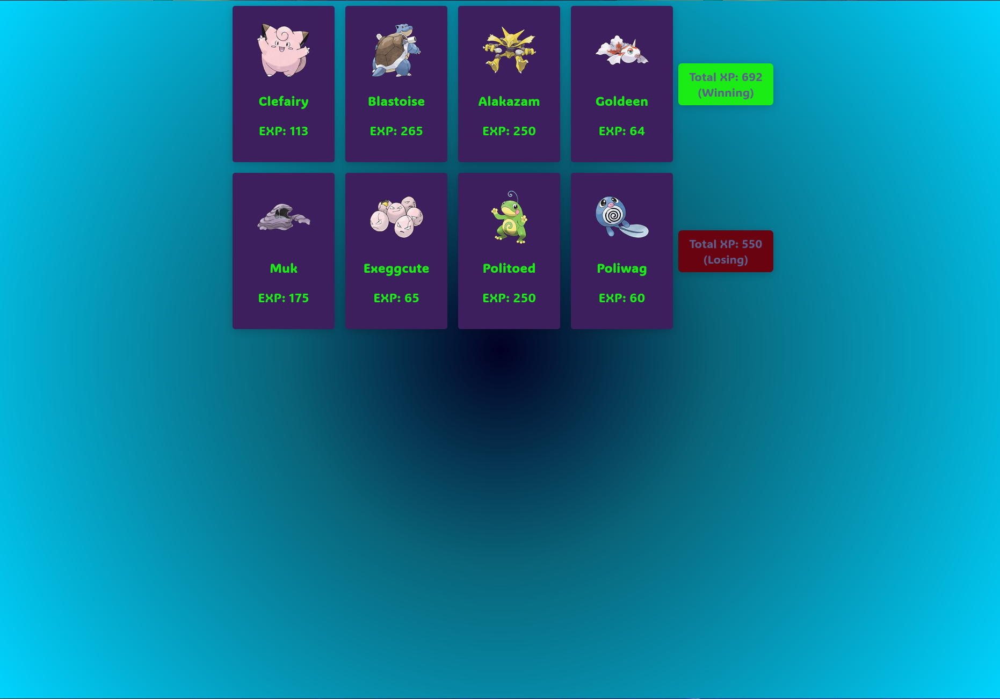

# Pokémon Card Game

A React-based card game that draws upon the extensive Pokémon database. Players get dealt random Pokémon cards with each having a unique experience point. The goal is to have the highest combined experience in a hand to win the game.

## Features:
- Fetches random Pokémon data from the PokéAPI.
- Beautiful card animations on deal.
- Dynamic background gradient and comprehensive styling for a visually pleasing experience.
- A clear winner declaration based on total experience of dealt cards.

## How to Play:
1. Start the game to get dealt a hand of Pokémon cards.
2. Each card displays a Pokémon with its associated experience.
3. Compare the total experience points with your opponent.
4. The hand with the highest total experience wins!

## Installation:
1. Clone this repository: `git clone https://github.com/j-breedlove/pokemon_react.git
2. Navigate to the project directory: `cd pokedex_game`
3. Install dependencies: `npm install`
4. Run the game locally: `npm start`

## Contributing:
Pull requests are welcome. For major changes, please open an issue first to discuss what you would like to change.
